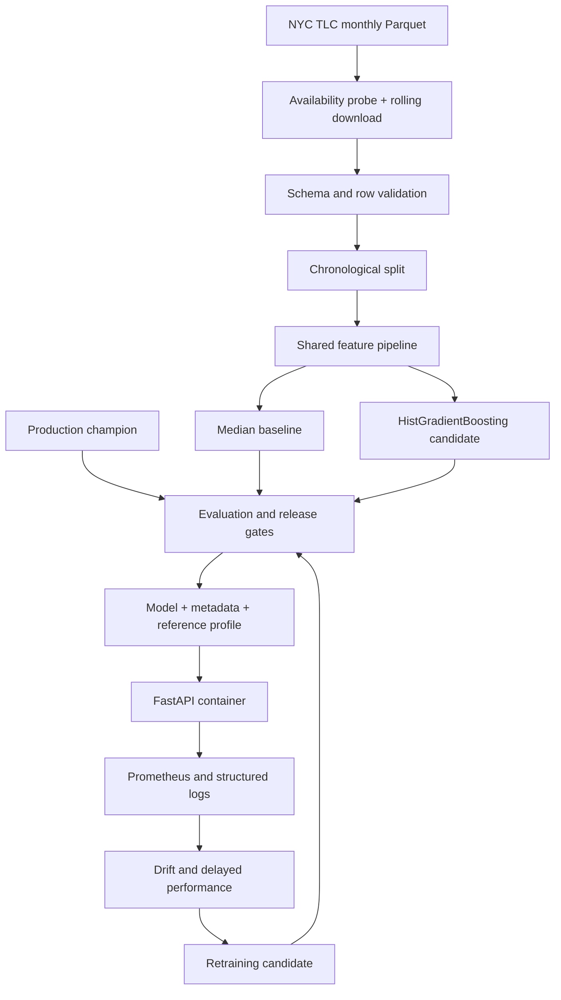

# NYC Taxi Trip Duration - Production ML System

A deliberately simple regression model surrounded by a complete, testable production lifecycle. The system
predicts a yellow-taxi trip's duration at trip start from information that is actually available at that
decision point.

## Why this project exists

Many portfolio projects optimize a notebook metric and stop. This repository treats the model as one component
of a controlled software system: immutable ingestion, schema checks, leakage prevention, chronological
evaluation, release gates, versioned artifacts, an HTTP contract, container hardening, CI/CD, operational
metrics, drift analysis, retraining, promotion, and rollback.

The model is intentionally conventional. Engineering correctness is the subject of the project.

## Prediction contract

**Decision point:** immediately before or at trip start.

| Field | Online input? | Training use | Reason |
|---|---:|---|---|
| Pickup datetime | Yes | Feature | Known at request time |
| Pickup zone (1-263) | Yes | Feature | Known at request time |
| Intended drop-off zone (1-263) | Yes | Feature | Supplied destination |
| Passenger count | Yes | Feature | Known at pickup |
| Drop-off datetime | No | Label only | Future information |
| Realized trip distance | No | Excluded | Unknown before trip completion |
| Fare, tolls, tip, total | No | Excluded | Post-trip and target-adjacent leakage |
| Payment type | No | Excluded | Usually finalized after trip |

Target:

```text
duration_minutes = (tpep_dropoff_datetime - tpep_pickup_datetime) / 60 seconds
```

The input API requires a timezone offset. It converts the instant to New York local time before applying the
same feature transformer used during training.

## Architecture



### Online request path

```text
JSON request -> Pydantic validation -> timezone normalization -> feature pipeline
             -> shared bounded prediction -> versioned JSON response
```

### Artifact contents and lineage

- `model.joblib`: fitted scikit-learn Pipeline containing feature engineering and regression.
- `metadata.json`: model version, UTC creation time, Git SHA, rolling-file checksum-manifest hash,
  resolved-config checksum, metrics,
  feature-contract version, and the Python/scikit-learn/numpy/pandas versions that wrote the artifact.
- `metrics.json`: gated data-quality report (rejections, out-of-period rows, exact duplicates and valid volume),
  per-file checksums, row counts, train/validation/test time
  ranges, selected boosting iterations, baseline, candidate metrics, test error breakdown by hour, weekday
  and route coverage, champion comparison, gate result.
- `reference_profile.json`: training distributions used for drift comparisons.

Joblib artifacts must only be loaded from the trusted CI/retraining path. They are not an untrusted interchange
format. The loader refuses an artifact whose recorded scikit-learn/numpy versions differ from the running
process; compatibility covers Python, scikit-learn, NumPy, pandas, and joblib. The service then stays live
but not ready, so no traffic is routed to it.

## Model and features

The mandatory baseline is a median `DummyRegressor`. The candidate is `HistGradientBoostingRegressor` with
absolute-error loss, trained on `log1p(duration)` and mapped back with `expm1`.

**What the model estimates.** Quantiles are invariant under monotone transforms, so
`argmin_c E|log1p(Y) - c| = log1p(median Y)`: after `expm1` the prediction is the conditional *median*
duration. The log transform does not change that target; L1 already provides tail robustness. What it buys
is additivity: multiplicative effects (rush hour slowing every route by a similar factor) become additive
in log space, which additive tree ensembles represent with fewer splits. Two consequences: `bias_minutes`
is structurally negative for right-skewed durations (reported, not gated), and consumers who sum predictions
(fleet planning) need a mean estimator instead, because a sum of medians is not the median of the sum.

**Boosting iterations** are chosen on the chronological validation segment via `staged_predict`, not by
HistGradientBoosting's built-in early stopping, which would hold out a random 10% of training rows.

Features are deterministic and leakage-safe:

- PU-DO route, pickup zone and drop-off zone, target-encoded (see below);
- passenger count;
- sine/cosine encoding of hour;
- sine/cosine encoding of weekday;
- weekend flag;
- rush-hour flag.

**Zone encoding.** TLC `LocationID`s follow the alphabetical order of zone names, so their numeric order has
no geographic meaning; feeding them as numbers (v1.0) forces the trees to carve 263 nominal categories with
threshold splits. Native categorical support in HistGradientBoosting is capped at 255 categories. v1.1
target-encodes the route (`PU*1000+DO`) and each zone with scikit-learn's `TargetEncoder`: cross-fitted
(out-of-fold) during training so a row never sees its own label, full-train statistics at inference,
smoothing toward the zone and global means, and the training mean for unseen routes. The encoder sits inside
`TransformedTargetRegressor`, so it encodes `log1p(duration)`. `model.zone_encoding: ordinal` restores the
v1.0 behaviour as a comparison arm (ADR 0004). Every evaluation path calls the same `predict_duration`
function, so validation, test, champion, offline, drift, and API scores all use the configured bounds.

This version intentionally omits live traffic, weather, route geometry, events, and realized distance.
Those are future challengers, not hidden assumptions.

## Data source and quality policy

The downloader targets the official monthly NYC Taxi & Limousine Commission yellow-taxi Parquet files. Raw
files are not committed. Each file is retained unchanged and identified by SHA-256 in model metadata.

Rows are rejected when required columns are missing/null or when any of these domain rules fail:

- pickup falls outside the source file's month (monthly TLC files contain stray rows from other months and
  years; left in, they sort to the ends of the chronological split and corrupt the test window and the
  recorded lineage periods). The month is taken from `--period YYYY-MM` or from the TLC file name;
- duration is outside 1-120 minutes;
- passenger count is outside 1-6;
- pickup/drop-off zone ID is outside 1-263 (264 = Unknown and 265 = Outside of NYC are not routable);
- timestamps cannot be parsed;
- an exact duplicate exists over the five retained source columns (the first row is kept; near-duplicates are
  retained because the public data has no stable trip ID).

Rejected, out-of-period, duplicate, and valid-row counts/rates are written to the training report and enforced
as release gates. Scheduled retraining probes whether the candidate object exists and walks backward within a
bounded lookback. Only 200/206 count as published and only 403/404 as not yet published; network
errors and other statuses are retried and then fail the run, so an outage cannot silently shift the window
to an older month. It then trains on a configurable three-month rolling window, validating every file against
its own source month before combining and chronologically splitting the rows.

## Repository map

```text
.
├── .github/workflows/       CI, gated artifact generation, immutable CD
├── configs/                 environment-specific validated configuration
├── data/                    ignored raw/processed data boundaries
├── docs/                    ADRs, model card, operations runbook
├── k8s/                     base manifests and staging/production overlays
├── monitoring/              Prometheus and provisioned Grafana dashboard
├── scripts/                 smoke test and deterministic sample generator
├── requirements.lock        hash-locked runtime dependencies (Python 3.11, linux x86_64)
├── requirements-dev.lock    hash-locked runtime + quality-tool dependencies
├── src/taxi_duration/
│   ├── data/                download, checksum, schema/domain validation
│   ├── features/            shared train/serve feature transformer
│   ├── models/              estimator factory, artifact metadata, runtime compatibility check
│   ├── monitoring/          reference profiles, PSI drift and data-quality rates
│   ├── serving/             FastAPI, schemas, metrics, health endpoints
│   └── training/            split, iteration selection, metrics, gates, champion comparison
├── tests/                   unit, contract, and integration tests
├── Dockerfile
├── docker-compose.yml
├── Makefile
└── pyproject.toml
```

## Quick start with synthetic data

Python 3.11 is the reference runtime.

```bash
python -m venv .venv
. .venv/bin/activate
python -m pip install --upgrade pip
pip install --require-hashes -r requirements-dev.lock
pip install --no-deps -e .
make sample        # January training file + February follow-up file
make train
make evaluate      # score the January model on February (out-of-period)
make drift         # distribution + data-quality check of February vs training reference
make serve
```

Then:

```bash
curl -s http://localhost:8000/health/ready
curl -s -X POST http://localhost:8000/v1/predict \
  -H 'Content-Type: application/json' \
  -d '{
    "pickup_datetime":"2025-01-15T08:30:00-05:00",
    "pickup_location_id":132,
    "dropoff_location_id":230,
    "passenger_count":1
  }'
```

OpenAPI is at `http://localhost:8000/docs`; Prometheus metrics are at `/metrics`.

The synthetic generator places zones at random latent coordinates and derives duration from the distance
between them with multiplicative time-of-day effects. It deliberately does *not* make zone-ID differences
predictive, since they are not predictive on real data. Synthetic metrics validate the plumbing only.

## Train with official TLC data

```bash
taxi-ml download 2025 1 --config-path configs/development.yaml
taxi-ml download 2025 2 --config-path configs/development.yaml
taxi-ml download 2025 3 --config-path configs/development.yaml
taxi-ml train data/raw/yellow_tripdata_2025-01.parquet \
  data/raw/yellow_tripdata_2025-02.parquet \
  data/raw/yellow_tripdata_2025-03.parquet \
  --config-path configs/development.yaml \
  --model-version 2025-q1-local

# True out-of-period check: the rolling-window model on later months
taxi-ml download 2025 4 && taxi-ml download 2025 5
taxi-ml evaluate data/raw/yellow_tripdata_2025-04.parquet --output-path reports/eval_2025-04.json
taxi-ml evaluate data/raw/yellow_tripdata_2025-05.parquet --output-path reports/eval_2025-05.json
```

The training command stops with a non-zero exit if release gates fail. It does not silently package a weak
candidate. The gate thresholds in `configs/base.yaml` must be calibrated from these real-data runs; publish
the resulting baseline / validation / test / out-of-period table here rather than synthetic numbers.

To compare against a released model, pass it explicitly:

```bash
taxi-ml train data/raw/yellow_tripdata_2025-02.parquet \
  --champion-model-path champion/model.joblib --champion-metadata-path champion/metadata.json
```

## Study guide (independent of CI)

The Turkish engineering guide is a learning companion generated from the current repository:

```bash
make pdf
```

The command writes `output/pdf/NYC_Taxi_Duration_Production_ML_Engineering_Guide.pdf`. The guide explains
the problem, architecture, ML lifecycle, release gates, deployment, monitoring, runbooks, and source files.
It is intentionally independent of application CI: no PDF generation or byte comparison is part of the
software test gate, and the guide does not hard-code a test count or coverage percentage.

## Quality commands

```bash
make format      # normalize source format and safe lint fixes
make lint        # format and static lint checks
make type        # strict mypy for application code
make test        # unit, contract, integration, coverage threshold
make security    # source and dependency vulnerability checks
```

## Local production stack

After training creates `artifacts/model.joblib` and `artifacts/metadata.json`:

```bash
docker compose up --build
```

Services:

- API: `localhost:8000`
- Prometheus: `localhost:9090`
- Grafana: `localhost:3000`

The API runs as a non-root user with a read-only root filesystem in Compose. The artifact directory is mounted
read-only. Set `GRAFANA_ADMIN_PASSWORD` outside source control.

## CI/CD behavior

### Pull request and main-branch CI

1. Install pinned-compatible project dependencies.
2. Check formatting and lint rules.
3. Run strict type checks.
4. Run all tests and enforce coverage.
5. Scan source and installed dependencies.
6. Build the production image from the digest-pinned Python base.
7. Scan the container for high/critical vulnerabilities.

### Gated retraining and release CD

The monthly/manual workflow accepts an explicit year/month or starts from a conservative lagged month,
probes the official object, walks backward until it finds a published month, resolves the complete rolling
window (normalised to `YYYY-MM`, so `1` and `01` behave identically), downloads it,
pulls the current `production` image and extracts its model as the champion, trains a candidate, and enforces
the gates including the champion comparison on the candidate's own test window. It then bakes that exact model
into a non-root image built from the same hash-locked runtime set, publishes provenance and an SBOM to GHCR, pins
the immutable digest into the Kustomize overlay (`kustomize edit set image`), applies it to staging, runs a
prediction smoke test, and promotes the same digest to the protected production environment. After a healthy
production rollout the digest is tagged `production`, which makes it the next run's champion. Production
failure after a successful production apply triggers Kubernetes rollout undo; earlier job failures cannot
roll back the healthy deployment. Champion retrieval fails closed: the first release, and a deliberate
lock-file upgrade (the old champion cannot be unpickled by the new runtime), must explicitly run with
`skip_champion`. Staging and production install the reviewed Kustomize version rather than relying on runner
state. Configure cluster
authentication with OIDC or a tightly scoped deployment integration before enabling the workflow; never store
kubeconfig in the repo. All third-party Actions are pinned to reviewed commit SHAs.

## Release gates

All thresholds live in configuration and are reviewed like code:

- maximum validation MAE;
- maximum test MAE;
- maximum test p95 absolute error;
- required relative improvement over the median baseline;
- maximum validation-to-test MAE gap;
- maximum rejection, out-of-period, and exact-duplicate rates plus minimum valid rows;
- champion non-inferiority: the one-sided upper confidence bound of the candidate-minus-champion paired
  absolute-error difference must not exceed the margin `max_regression_vs_champion` × champion MAE (default
  1%). The standard error is cluster-robust over pickup hours, because trips in the same hour share traffic
  and their errors are correlated. The margin must be positive: with a zero margin the rule becomes a
  superiority test and blocks about 95% of retrains that are exactly as good as the champion. A champion
  that exists but cannot be evaluated blocks release.

The test segment is used for release assessment, not hyperparameter search. Repeated experimentation against it
invalidates it; advance the temporal window and establish a new final holdout when that happens.

## Monitoring strategy

### Immediate operational signals

- request count by status (`success`, `error`, `unavailable`, and `invalid` for 422 contract violations);
- latency histogram and p95 query;
- prediction distribution;
- liveness/readiness.

Each container runs a single uvicorn worker. `prometheus_client` keeps metrics per process, so several
workers behind one `/metrics` endpoint would return a different worker's counters on each scrape and
Prometheus would read them as counter resets. Scale-out comes from Kubernetes replicas, each scraped as
its own target;
- structured JSON logs with request ID and model version.

### Statistical signals without labels

Reference profiles are created from training data. `taxi-ml drift` computes PSI for pickup hour, passenger
count, pickup zone, drop-off zone, route, and bounded predictions; it also reports unseen-route rate and,
separately, the share of missing and out-of-range numeric values. The two are reported
apart because `np.histogram` drops invalid values and renormalises: a batch with 20% broken rows would
otherwise look distribution-stable. An invalid rate above `monitoring.max_invalid_rate` is `critical`;
`--fail-on-critical` makes the command exit non-zero for schedulers. PSI is an alerting heuristic, not proof
of model failure. Typical investigation bands are below 0.10,
0.10-0.25, and above 0.25; thresholds must be calibrated to actual traffic and seasonality.

### Delayed performance with labels

When drop-off labels arrive, join them to prediction events using a privacy-reviewed event identifier outside
this demo. Track MAE, p95 absolute error, and bias overall and by hour, weekday, route frequency, and zone. A
performance breach blocks promotion and opens investigation; it should not trigger blind deployment.

The demo deliberately does not persist raw requests. Production logging must minimize or hash identifiers,
define retention, and follow the organization's privacy policy.

## Security and reliability controls

- strict request schema with unknown fields forbidden;
- non-root container, read-only filesystem, dropped Linux capabilities;
- no secrets in images or repository;
- artifact/data/config hashes for traceability;
- immutable digest promotion;
- health probes and bounded resources;
- source, dependency, and image scanning;
- protected GitHub environments for production approval;
- explicit rollback runbook.

## Known gaps before a real public launch

This repository is deployable scaffolding, not a claim that one generic manifest completes a company-specific
platform. Before real traffic, add authenticated cluster integration, TLS/ingress, rate limiting, network
policies, secret manager wiring, autoscaling, durable telemetry, SLO alerts, backup/retention policy, a real
model registry approval interface, canary traffic, and load/capacity tests. Establish governance ownership and
on-call escalation as well.

## Reproducibility

`requirements.lock` and `requirements-dev.lock` pin every transitive package and wheel hash for the reference
platform (Python 3.11, linux x86_64); `make lock` regenerates them. CI, retraining and Docker install with
`--require-hashes`, so
the artifact is unpickled by the library versions that wrote it, and the load-time check turns any drift
into an explicit not-ready state. For regulated deployment, add an internal wheel/container mirror.
Model metadata captures code, data, configuration, metrics, and contract identity so a released artifact can be
traced back to its inputs.

## License

Code is MIT licensed. TLC data is external and governed by its publisher's terms; it is not redistributed here.
