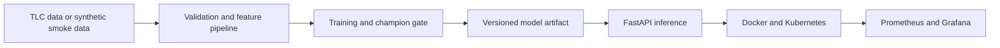
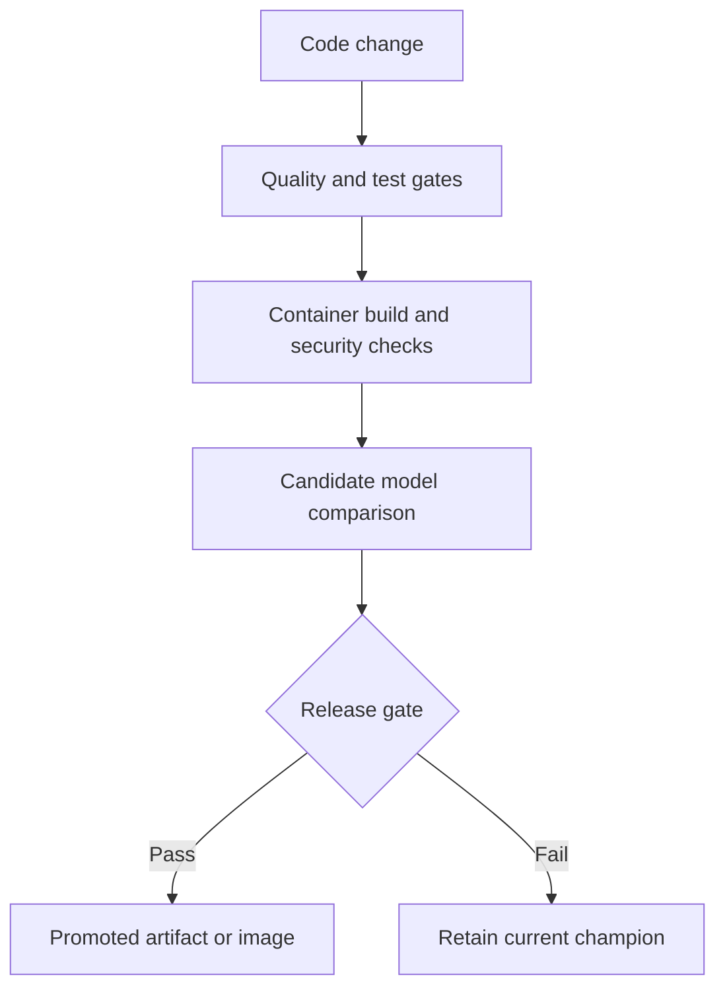

# MLOps and Production ML

This area is for the engineering work that begins after a model performs acceptably in a notebook. The focus is reproducibility, artifact lineage, tested inference, controlled releases, observability and a clear separation between research code and the production path.

## Current project

### [NYC Taxi Trip Duration Production ML](./NYC_Taxi_Duration_Production_ML/)

The prediction task is trip duration for NYC yellow taxis. The larger purpose is to build and test the surrounding ML system.

The repository includes:

- a deterministic training and evaluation path;
- artifact manifests, checksums and lineage metadata;
- a FastAPI inference service with health and metrics endpoints;
- Docker and Docker Compose definitions;
- Kubernetes base manifests and staging or production overlays;
- unit, integration, API-contract and container checks;
- pull-request and main-branch CI;
- gated retraining with champion non-inferiority checks;
- Prometheus metrics and a provisioned Grafana dashboard;
- data cards, a model card, architecture decisions and an operational runbook.

## Delivery model

This is a production-oriented reference implementation, not a claim that the public demonstration is operating a live taxi platform. Cloud identity, secrets management, managed infrastructure, traffic routing and organisational incident processes remain deployment-specific responsibilities.

## Research direction

Future work in this area will use separate projects to examine:

| Direction | Engineering question |
| --- | --- |
| Experiment tracking and registry | How are parameters, data versions, metrics and promotion decisions made traceable across training runs? |
| Automated training and deployment | Which checks should block model promotion, and which can remain diagnostic? |
| Cloud inference | How should container registry, managed compute, identity, secrets and rollback be connected? |
| Production RAG | How should retrieval quality, answer grounding, latency, cost and document freshness be monitored together? |

New folders will be added when those systems are implemented. The roadmap is not presented as completed functionality.

