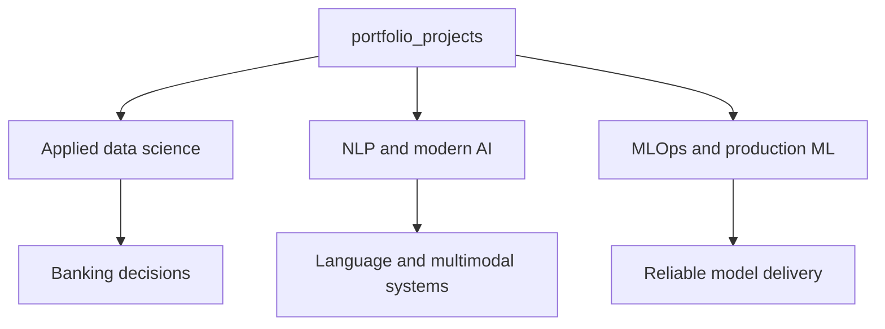
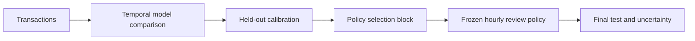
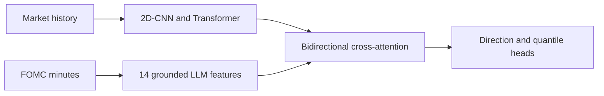
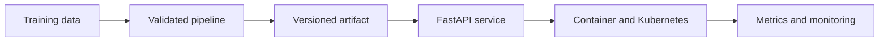

# Data Science, AI and Production ML Portfolio

This repository contains applied data science projects, modern AI research and production ML work. The projects are different in subject, but they follow the same research discipline: define the decision or forecasting problem first, establish a defensible validation design, compare against clear baselines, and keep the limits of the data visible.

The repository is organised around three working lines. Quantitative finance projects that need their own research context also appear in the separate [Quantitative_Research](https://github.com/ugural87/Quantitative_Research) repository.



## Project map

| Project | Problem | Main methods | Status |
| --- | --- | --- | --- |
| [Bank Customer Churn](./bank-churn/) | Retention targeting under explicit campaign economics | Logistic regression, XGBoost, LightGBM, calibration, cost-sensitive policy and propensity analysis | Complete |
| [Credit Risk and IFRS 9](./credit-risk/) | PD estimation carried into staged, scenario-weighted expected credit loss | XGBoost, SHAP, calibration, SICR, LGD, EAD and ECL sensitivity | Complete |
| [Customer Segmentation](./customer-segmentation/) | Whether transaction behaviour contains defensible customer groups | RFM+, K-Means, DBSCAN, PCA, t-SNE and action mapping | Complete |
| [Credit Card Fraud Decision System](./fraud-detection/) | Rare-event detection under review-capacity and cost constraints | Temporal CV, imbalance methods, focal-loss MLP, calibration and frozen policy evaluation | Complete |
| [US10Y and FOMC Forecasting](./us10y_fomc_llm_forecasting/) | Whether information in FOMC minutes adds signal beyond prices and rate facts | 2D-CNN, Transformer, LLM semantic extraction, cross-attention, walk-forward and ablations | Complete |
| [NYC Taxi Production ML](./MLOps/NYC_Taxi_Duration_Production_ML/) | Taking a regression model into a tested inference and release system | FastAPI, Docker, CI/CD, monitoring, Kubernetes, release gates and artifact lineage | Complete |

## How the work fits together


Not every project needs every box. A segmentation study does not require probability calibration, and a research pipeline is not automatically a deployable service. The point is to use the parts that the problem requires and to say explicitly which parts are absent.

## Applied data science

### Bank customer churn

The churn series treats retention as a resource-allocation problem. Three model families are compared under a common search design, then probability calibration and a cost matrix turn predicted churn risk into a contact policy. A separate propensity analysis asks whether customer activation can be treated as an intervention rather than merely a predictive feature.

### Credit risk and IFRS 9

The credit-risk project starts with probability of default and continues to the quantity used in provisioning. Calibrated PD estimates feed SICR rules, staging, LGD and EAD assumptions, macroeconomic scenarios and expected credit loss. Sensitivity analysis keeps the impact of those assumptions visible.

### Customer segmentation

K-Means, DBSCAN, PCA and t-SNE are used to test how much cluster structure the RFM feature space actually supports. The result is deliberately modest: the customer space behaves more like a continuum than separated islands, so the clusters are useful operating partitions rather than natural customer species.

### Credit card fraud

The fraud project uses chronological partitions for training, model selection, calibration, policy selection and final testing. Classical imbalance strategies are compared with PyTorch MLP challengers. The selected focal-loss model is converted into an hourly review queue under explicit capacity and loss assumptions. The repository includes tests, saved artifacts, a business dashboard, a model card and a data card.



## NLP and modern AI

The first completed system in this line is the US10Y and FOMC project. It does not use an LLM as an unexamined oracle. The LLM produces a versioned, sentence-grounded set of 14 semantic features from consecutive FOMC minutes. These features are fused with market representations and tested against price-only, rate-only and shuffled-text controls.



The current build plan adds two distinct lines rather than a collection of chatbots:

1. A sentiment-classification system built from crawled web data, text cleaning, Word2Vec embeddings and RNN or LSTM models, with TF-IDF and simpler classifiers as baselines.
2. Evaluated LLM systems covering document ingestion, chunking, embeddings, retrieval, reranking, grounded generation, faithfulness tests and later tool-using agentic workflows.

These are roadmap items, not implemented folders yet. The relevant directories will be created when the first working project is added.

## MLOps and production ML

The [MLOps area](./MLOps/) begins with NYC Taxi trip-duration prediction, but the regression task is only the test case. The main work is the controlled path from data and training through versioned artifacts, a FastAPI service, container hardening, automated tests, CI/CD, release comparison, monitoring and deployment manifests.



## Validation principles

The implementation changes by problem, but several rules are stable:

- Split design follows how information becomes available in the real problem.
- Preprocessing, resampling and model selection stay inside the training boundary.
- Complex models must earn their place against a simpler baseline.
- Probabilities are calibrated when the downstream decision depends on their numerical meaning.
- Ablations and shuffled controls are used when an architecture contains multiple information sources.
- Predictive association is not described as causal evidence.
- Business impact remains conditional on explicit assumptions when public data do not contain real intervention outcomes or accounting values.
- Production claims require tests, artifact contracts, release controls and operational visibility.

## Repository structure

```text
portfolio_projects/
├── bank-churn/
├── credit-risk/
├── customer-segmentation/
├── fraud-detection/
├── us10y_fomc_llm_forecasting/
│   └── us10y_fomc_llm_forecasting/
├── MLOps/
│   ├── README.md
│   └── NYC_Taxi_Duration_Production_ML/
└── README.md
```

Each project README contains its own data contract, methods, results, limitations and reproduction instructions. This page is the map across projects.

