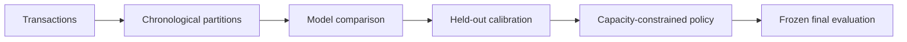

# Credit Card Fraud Decision System

An executed, end-to-end fraud project covering rare-event prediction, temporal validation, probability calibration, constrained decision economics, deep learning and semi-synthetic causal policy evaluation.

The repository treats fraud detection as a decision system. The final object is a calibrated score plus a frozen review policy under explicit capacity and cost assumptions.


## Decision-system map



## What is fixed in this version

- Downloads the canonical raw OpenML ARFF so the `Time` row identifier is retained.
- Rejects cached data with missing or unexpected columns.
- Records the source SHA-256 digest and canonical count checks.
- Removes exact duplicate rows before all splits and reports the impact.
- Uses expanding temporal folds for hyperparameter comparison.
- Separates train, model validation, calibration, policy selection and final test blocks.
- Tunes unweighted, class-weighted, SMOTE and imbalance-ensemble alternatives.
- Uses positive Brier score consistently and adds Brier skill and PR-AUC lift.
- Enables LightGBM row subsampling with `subsample_freq=1`.
- Freezes the decision policy before evaluating the final test block.
- Enforces review capacity within elapsed-hour queue windows rather than ranking the entire future holdout.
- Reports gross prevented loss, review cost, friction cost, net savings and uncertainty separately.
- Uses cross-fitted nuisance estimates, overlap diagnostics, effective sample size and full-refit bootstrap in the causal demonstration.
- Adds a PyTorch MLP challenger with weighted BCE and focal loss.
- Includes executed notebooks, tests, saved metrics, figures, models and a business dashboard.

## Repository structure

```text
.
├── configs/base.json
├── data/                         # downloaded automatically; excluded from Git/ZIP
├── src/fraud_detection/
│   ├── data.py                   # acquisition, schema and duplicate audit
│   ├── splitting.py              # five chronological partitions
│   ├── features.py
│   ├── modeling.py               # temporal CV and imbalance strategies
│   ├── deep.py                   # weighted BCE and focal-loss MLP
│   ├── decision.py               # capacity and economic policy
│   ├── causal.py                 # cross-fitted semi-synthetic AIPW audit
│   └── reporting.py
├── scripts/
│   ├── run_pipeline.py
│   └── build_notebooks.py
├── notebooks/                    # executed analysis notebooks
├── artifacts/                    # executed metrics and fitted systems
├── reports/figures/              # publication-quality figures
├── tests/
├── DATA_CARD.md
├── MODEL_CARD.md
├── BUSINESS_CASE.md
└── RESULTS.md
```

## Environment

Python 3.11 to 3.13 is supported. The delivered results were executed with the exact versions in `requirements-lock.txt`.

```bash
python -m venv .venv
source .venv/bin/activate
python -m pip install --upgrade pip
python -m pip install -e ".[dev]"
```

## Run

Laptop-oriented run:

```bash
python scripts/run_pipeline.py
python scripts/build_notebooks.py --execute
python -m pytest
```

Wider searches, longer deep training and more causal bootstrap repetitions:

```bash
python scripts/run_pipeline.py --full
```

The first run downloads approximately 144 MiB from the official OpenML raw-file endpoint and converts it to a validated CSV. Data files remain under `data/` and are intentionally excluded from version control and the delivered ZIP.

## Evaluation protocol

Transactions are sorted by elapsed `Time` and split into five non-overlapping blocks:

| Block | Share | Purpose |
|---|---:|---|
| Train | 55% | temporal CV and model fitting |
| Validation | 10% | model-family selection |
| Calibration | 10% | held-out Platt calibration |
| Policy | 10% | threshold and policy selection |
| Test | 15% | one final frozen-system evaluation |

Exact timestamp ties are kept in the same adjacent partition. Exact duplicate rows are removed before the split.

## Models and imbalance handling

- Logistic Regression: unweighted, class-weighted and leakage-safe SMOTE
- XGBoost: `scale_pos_weight`
- LightGBM: `scale_pos_weight`
- Balanced Random Forest
- EasyEnsemble
- Deep MLP: weighted binary cross-entropy and focal loss

Accuracy is not a primary metric. The project reports PR-AUC, lift over prevalence, ROC-AUC, Brier score, Brier skill, log loss, precision, recall, F1 and MCC.

## Business interpretation

The action is an hourly review queue. The economic policy uses transaction-specific expected avoidable loss and an explicit review-capacity constraint. Financial outputs are expressed in currency units because the public dataset does not define the currency.

All savings are scenario estimates under editable assumptions in `configs/base.json`. They are not realized savings from an identified bank. See `RESULTS.md` and `BUSINESS_CASE.md`.

## Causal interpretation

The ULB data contain no real treatment or post-intervention outcome. The causal notebook constructs a logged review policy and known potential outcomes to test propensity weighting, matching, g-computation and cross-fitted AIPW. It is an estimator audit and implementation template, not a causal claim about the public dataset.

## Data source

Dal Pozzolo, A., Caelen, O., Johnson, R. A., and Bontempi, G. (2015). *Calibrating Probability with Undersampling for Unbalanced Classification*. IEEE SSCI. OpenML dataset 1597.

## License

Code is released under the MIT License. The downloaded dataset remains subject to its source terms and is not redistributed in this repository.

