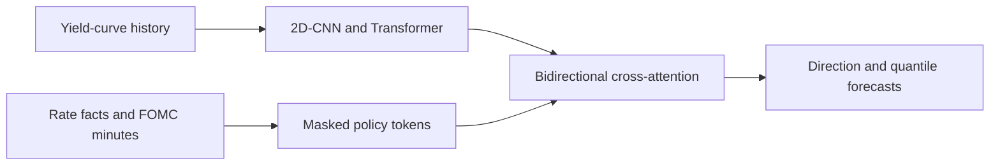

# US10Y and FOMC LLM Forecasting

The complete project is located in [us10y_fomc_llm_forecasting/](./us10y_fomc_llm_forecasting/).

It studies five-business-day changes in the US 10-year Treasury yield around scheduled FOMC meetings. A market encoder combines a multiscale 2D-CNN with a Transformer. A separate policy stream contains authoritative rate facts and 14 sentence-grounded semantic features extracted from consecutive FOMC minutes. Bidirectional cross-attention connects the two streams before direction and quantile outputs.

The minutes are aligned to their meeting dates as an oracle-information study. The project asks whether information later documented in the minutes would have explained the meeting-window move if it had been available at the decision point. It is not presented as a deployable real-time trading strategy.

See the [full README](./us10y_fomc_llm_forecasting/README.md) for the leakage boundary, extraction contract, walk-forward design, ablations, checkpoint rules and reproduction instructions.

